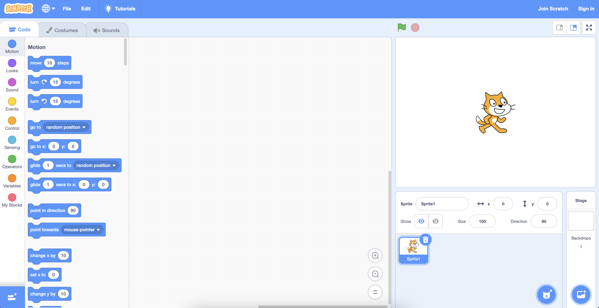

# Спрайты
{:.no_toc}

* TOC
{:toc}

## Введение

* Scratch — это язык программирования на основе визуальных блоков, изначально разработанный командой [Media Lab Массачусетского технологического института](https://www.media.mit.edu/about/overview/), а теперь поддерживаемый собственным фондом [Scratch Foundation](https://scratch.mit.edu/credits).
* Собирая «кусочки головоломки» в Scratch, мы можем создавать визуальные истории, анимацию, игры и другие программы.
* Мы будем изучать и использовать концепции и идеи программирования, такие как функции, циклы, условия и переменные.
* Несмотря на то, что Scratch использует визуальные блоки, а не текстовый код, его программы основаны на тех же фундаментальных идеях и используют те же принципы вычислительного мышления.

## Основы интерфейса

* Мы можем перейти на [сайт Scratch](https://scratch.mit.edu/), нажать «Начать создание», где мы увидим такой интерфейс:
  
  * С левой стороны у нас есть библиотека блоков, из которой мы можем перетаскивать любую их комбинацию в среднюю секцию, называемую редактором блоков, где мы будем строить наш проект.
  * В правом верхнем углу у нас есть сцена, на которой наш проект будет запущен и показан другим, просматривающим или использующим его.

## Спрайты

### Именование и позиционирование

* Когда мы создаем новый проект, мы видим персонажа Scratch cat, называемого **спрайтом**, который является просто объектом, который может появиться на сцене.
* Под сценой мы видим все спрайты в нашем проекте, и в настоящее время у нас есть только кот по имени «Sprite1».
* Мы можем перемещать нашу кошку по сцене, просто щелкая и перетаскивая ее. Обратите внимание, что значения положения спрайта меняются при его перемещении. Например, значение x равно 177, а значение y равно 42, когда спрайт перемещается вправо вверх:
  
* Оказывается, спрайты расположены на координатной сетке x и y на сцене, где значение x показывает, насколько далеко влево или вправо находится наш спрайт, а значение y показывает, насколько далеко вверх или вниз на сцене. стадия это.
* Идеальным центром сцены является (0, 0), и положительные значения x сместят спрайт вправо, а отрицательные значения x переместят его влево. Точно так же положительные значения y будут перемещать спрайт вверх, а отрицательные значения y — вниз.
* Мы можем видеть текущую позицию спрайта в виде значений x и y, но мы также можем немного контролировать их с помощью блоков.
* Мы также можем изменить значения x и y нашего спрайта напрямую, щелкнув значения и введя то, что мы хотим. И мы можем нажать на название спрайта и изменить его на что-то другое. Это поможет нам отслеживать наши спрайты, когда мы начнем добавлять их в наш проект.
* Мы также можем показать или скрыть каждый спрайт с помощью переключателя с надписью «Показать» и изменить размер (в процентах) или направление, которое поворачивает кошку лицом на определенное количество градусов:
  
  * Когда мы нажмем на значение «Направление», мы увидим маленький диск, который мы можем повернуть, что также повернет наш спрайт на сцене.

### Добавление спрайтов

* Добавим новый спрайт. Мы можем нажать кнопку с небольшим плюсом в нижней части области спрайта и увидеть несколько вариантов добавления нового спрайта:
  
* Сейчас мы воспользуемся основной кнопкой «Выбрать спрайт» и увидим большой список спрайтов, поставляемых со Scratch, которые мы можем использовать. Мы можем щелкнуть по категориям или использовать окно поиска, чтобы найти что-то конкретное.
* Мы нажмем на Рыбу и увидим, что оба спрайта теперь на нашей сцене. Мы можем перемещать их, чтобы они не перекрывались.
* У нас также есть оба спрайта в нижней области, и тот, который выделен синим цветом, — это тот, который выбран, и тот, с которым мы работаем. Например, мы можем щелкнуть по каждому из них, чтобы изменить их положение или размер.
* Мы можем щелкнуть правой кнопкой мыши (или удерживать клавишу управления и щелкнуть) по нашей рыбе и увидеть меню с некоторыми параметрами. Мы можем нажать «дублировать», и теперь у нас на сцене будут две рыбки:
  
  * Затем мы можем перемещать их, чтобы они не перекрывались:
    
* Мы можем увидеть этот пример в [Sprites](https://scratch.mit.edu/projects/507419806/).

### Костюмы

* У каждого спрайта есть **костюм**, который является просто изображением того, как выглядит спрайт.
* В левом верхнем углу мы можем использовать вкладку «Костюмы»:
  
  * Мы увидим, что у нашей рыбки четыре костюма: «fish-а», «fish-b», «fish-с» и «fish-d», и мы можем выбирать разные, щелкая по ним.
* Для кота у нас есть два разных костюма, где его ноги находятся в разных положениях. Переключаясь между ними, мы можем создать впечатление, что он идет.
* В редакторе костюмов мы даже можем добавлять новые костюмы с помощью кнопки внизу слева, со знаком плюс. Мы можем добавить костюмы с нуля или нарисовать свои собственные с помощью инструментов в центре.
* Мы также можем редактировать встроенные костюмы, выбирая их и используя инструменты, чтобы изменить их так, как мы хотим.
* Мы можем увидеть этот пример в [костюмах](https://scratch.mit.edu/projects/507420136/).
* Наконец, мы можем загрузить нашу собственную фотографию или изображение с нашего компьютера, чтобы использовать его в качестве костюма.

### Звуки
* Мы можем использовать вкладку «Звуки» вверху, чтобы дать звуки спрайтам:
  [sounds](sounds.png)
* Мы видим, что у нашей рыбы есть звук «пузырей» и звук «морской волны», а если мы выберем нашу кошку на панели спрайтов, мы увидим, что у нее есть только один звук, звук «мяу».
* Мы можем изменить встроенные звуки, записать или загрузить свои собственные.

### Фоны
* Наша сцена имеет простой белый фон, поэтому мы можем нажать кнопку в правом нижнем углу, чтобы выбрать новый фон:
  [stage](stage.png)
* Теперь мы увидим много разных фонов, и мы будем использовать подводный фон для нашей рыбы.
* Но наш кот теперь не на своем месте, поэтому мы можем щелкнуть по нему на панели спрайтов и использовать значок корзины, чтобы удалить его.
* Мы можем перевернуть нашу желтую и зеленую рыбу, изменив поворот на отрицательные 90 градусов, но это перевернет нашу рыбу вверх ногами. Оказывается, мы можем изменить стиль вращения с кругового (круг слева) на лево-правый (треугольники в центре):
  [flipped_direction](flipped_direction.png)
  * Теперь наш спрайт будет смотреть только влево или вправо.
* В правом верхнем углу мы можем щелкнуть полноэкранный значок, чтобы увидеть нашу сцену и спрайты в полноэкранном режиме.
* Мы можем увидеть этот пример в [Backdrops](https://scratch.mit.edu/projects/507420944/).

### Сохранение
* Чтобы сохранить наш проект, чтобы мы могли сохранить его и использовать позже, мы можем использовать меню «Файл» в левом верхнем углу, чтобы сохранить его:
  [save](save.png)
  * После того, как мы сохраним наш проект, мы можем загрузить его позже, используя опцию «Загрузить с вашего компьютера» в том же меню.
* Мы также можем создать учетную запись в Scratch с помощью кнопки «Присоединиться к Scratch» в правом верхнем углу, которая сохранит наш проект на веб-сайте Scratch. Это также позволит нам легко поделиться нашим проектом с другими.

### В следующий раз
* В следующий раз мы начнем использовать эти блоки кода для программирования наших спрайтов для выполнения различных действий и даже для создания интерактивных историй и игр на основе ввода человека.
