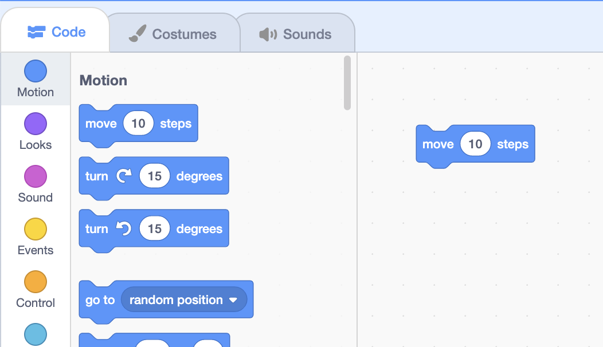
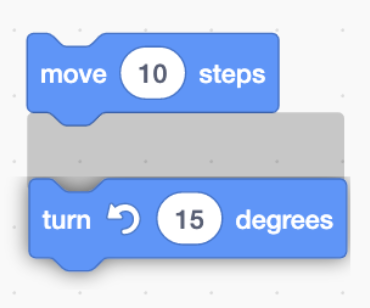

# Функции
{:.no_toc}

* TOC
{:toc}

## В прошлый раз

* В прошлый раз мы представили сцену и спрайты с костюмами, звуками и фонами. Но все наши изменения мы вносили вручную, например, кликая и перетаскивая.
* Мы откроем новый проект Scratch и вспомним, что мы можем перемещать нашего кота по сцене, щелкая и перетаскивая его или изменяя значение его координат x и y.

## Функции

* Слева от интерфейса Scratch мы увидим блоки.
* Функция в контексте Scratch — это некоторый блок, выполняющий некоторую задачу.
* Самый первый блок, например, говорит «сдвинуться на 10 шагов», и мы можем его использовать, перетащив из библиотеки блоков влево, в редакторскую часть нашего проекта по центру.
    
* Теперь мы добавили нашу первую функцию, и если мы щелкнем по блоку, мы увидим, что наш кот сместится немного вправо, а также обновилось значение x его положения.
* Мы можем увидеть этот пример в [Move](https://scratch.mit.edu/projects/507421820/).

## Входы

* Обратите внимание, что в блоке есть область со значением 10, которую мы можем изменить. Это значение называется входными данными для функции или информацией, которую функция может использовать для изменения своего поведения.
* Для блока перемещения входными данными является число, указывающее количество шагов для перемещения. Мы можем изменить его, чтобы переместить нашу кошку на 30 шагов, например:
  ```scratch
  move (30) steps
  ```
* Мы также можем добавить другие блоки, например:
  ```scratch
  turn right (15) degrees
  ```
* Мы можем увидеть этот пример в [Move and Turn](https://scratch.mit.edu/projects/507422307/).

## Скрипты

* Мы можем захотеть, чтобы наши блоки были объединены, чтобы можно было выполнить последовательность нескольких инструкций.
* Мы можем соединить наши два блока вместе, перетащив один из них к другому, и мы увидим выделенную область, когда они находятся близко друг к другу:
    
  * После того, как мы отпустим мышь, мы увидим, что они сцепились.
* Теперь нашу стопку блоков можно назвать **скриптом**, где все блоки будут запускаться по порядку, сверху вниз, когда мы нажимаем на один из них:
  ```scratch
  move (30) steps
  turn right (15) degrees
  ```
  * Мы можем щелкать эту стопку блоков снова и снова, и они заставят нашу кошку двигаться по кругу.
* Есть много блоков, которые мы можем использовать для наших скриптов, в нескольких категориях. Мы также можем попробовать этот блок:
  ```scratch
  go to (random position v)
  ```
* И если мы хотим удалить блок, мы можем удерживать клавишу управления и щелкнуть или щелкнуть правой кнопкой мыши и выбрать опцию «Удалить блок». Мы также можем перетащить блок обратно в библиотеку блоков, и он исчезнет, если мы отпустим его где-нибудь внутри этой области.

## Ходить вокруг
* Мы удалим нашу кошку и выберем новый спрайт для нашей следующей программы, [Glide](https://scratch.mit.edu/projects/507422729/), где наш спрайт будет перемещаться по сцене.
* Давайте воспользуемся ежиком и начнем с блока «перейти», чтобы убедиться, что мы начинаем с верхнего левого угла:
  ```scratch
  go to x: (-180) y: (120)
  ```
* Мы будем использовать другой блок, чтобы переместить нашего ежа в правый верхний угол после:
  ```scratch
  go to x: (-180) y: (120)
  go to x: (180) y: (120)
  ```
* Затем мы хотим перейти в правый нижний угол:
  ```scratch
  go to x: (-180) y: (120)
  go to x: (180) y: (120)
  go to x: (180) y: (-120)
  ```
* И, наконец, нижний левый, оба значения отрицательные:
  ```scratch
  go to x: (-180) y: (120)
  go to x: (180) y: (120)
  go to x: (180) y: (-120)
  go to x: (-180) y: (-120)
  ```
* Когда мы нажимаем на эту стопку блоков, наш ёжик сразу же прыгает в нижний левый угол. Оказывается, наш компьютер очень быстро запускает наши программы, поэтому ёжик двигался так быстро, что мы видели только конечную локацию.
* Мы можем использовать другой блок, называемый «скольжение», для перемещения в течение некоторого времени. Мы перетащим три нижних блока «перейти к» из нашего скрипта, так как мы по-прежнему хотим начать сразу с верхнего левого угла, и добавим блоки «скольжения» для каждой из трех других позиций, как и раньше:
  ```scratch
  go to x: (-180) y: (120)
  glide (1) secs to x: (180) y: (120)
  glide (1) secs to x: (180) y: (-120)
  glide (1) secs to x: (-180) y: (-120)
  ```
* Теперь, когда мы снова запускаем наш скрипт, нажимая на стопку блоков, мы видим, как наш ёжик двигается, как мы и ожидали. Мы можем добавить еще одно скольжение, чтобы оно вернулось в исходное положение:
  ```scratch
  go to x: (-180) y: (120)
  glide (1) secs to x: (180) y: (120)
  glide (1) secs to x: (180) y: (-120)
  glide (1) secs to x: (-180) y: (-120)
  glide (1) secs to x: (-180) y: (120)
  ```

## Комментарии
* Наша программа немного усложняется, поэтому мы можем использовать комментарии или краткие описания того, что мы пытались сделать, в качестве напоминания для себя или руководства для других, чтобы понять нашу программу.
* Мы можем щелкнуть правой кнопкой мыши по нашей стопке блоков и использовать «Добавить комментарий», чтобы написать комментарий, например заметку для нас, которая не повлияет на работу нашей программы:
  ```scratch
  go to x: (-180) y: (120) // These blocks move the sprite in a rectangle.
  glide (1) secs to x: (180) y: (120)
  glide (1) secs to x: (180) y: (-120)
  glide (1) secs to x: (-180) y: (-120)
  glide (1) secs to x: (-180) y: (120)
  ```
* Мы можем использовать другие блоки движения, чтобы изменить направление нашего спрайта, а также двигаться другими способами.
